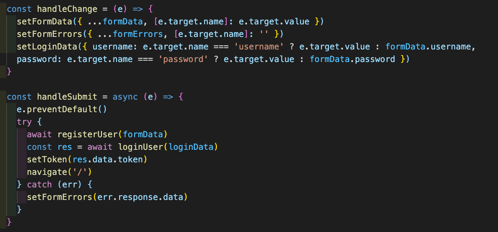

# Project 4

## Overview

### Brief

The brief was to create a full-stack with a Django backend and a React frontend. Project 4 could be done individually or as a team - I chose to work in a team with Alex Chan, Alex Theoklitou and Joe Freeman.

We chose to build a dog rehoming site based loosely off the Dog’s trust. The users are able to create accounts, favourite and ask questions about the dogs and are able to interact through a variety of controlled forms.

### Built with

- HTML
- CSS
- Tailwind
- JavaScript
- React.js
- Python
- Django
- Axios
- Git
- GitHub

## Deployment

You can view the deployed app [here](https://the-paw-hub.netlify.app/)

## Process

### Planning

We created an ERD diagram to plan the backend models and establish the relationships between them. We wanted to utilise many-to-many relationships to challenge our ability to work with SQL databases. 

We then created a plan for which pages we were going to try and recreate from the Dog’s Trust. A lot of the pages were static information pages. We decided to ignore most of these as we wanted to focus on features over content.

We decided to work together on zoom. We were all confident enough to work on aspects of this project independently, but we had decided to work in a team because we enjoyed the team-work atmosphere and had built a good friendship over the course. We were able to have daily stand-ups and discussions of where priorities needed to be shifted, and team-solve any major issues that came up unexpectedly. 

## Building the backend

We decided to tackle the back end together and finish this before beginning the front end. This made sure everyone was aware of the interactivity possible with the backend and also meant that we were able to make minor tweaks as a group.

We created two apps, one for dogs and one for authorisations. We were able to use the generics built into Django for a lot of the views. For the user login we had to create some custom code.

For authorisation, we decided to use JWT as this was the auth system we were most comfortable with.

The backend code we were most happy with was the use of nested serialisers. We had several relations that we wanted to achieve, both one-to-many and many-to-many, and we found nested serialisers were the best way to achieve this.

We had the backend and seeding data complete after the first day and we then went about seeding the data for the dogs and creating some dummy user data.

## Front End
 
The key features on the front end are;
- Registering and Logging in
- Viewing, favouriting and asking questions about dogs
- Signing up to the newsletter
- Donating
- Homepage

### Registering and Logging in

Registering and logging in was led by myself and are done through controlled react forms. Django’s built in error handling is used in almost all cases except for password confirmation not matching.

We also imported the login function into the registration submit function. This allows for a smoother UX and doesn’t require logging immediately after the registration is successful.

Logging in also allows users to access features such as favouriting and asking questions.

### The dogs

This dogs' view page shows cards of each dog - some have a ‘new’ flag on their container which is a CSS shape that dynamically renders based on the date that the dog was put in the database. One of the big challenges I faced was working between the two time syntaxes from Django on the backend and JavaScript on the front. These cards and triangles are reused in several parts of the website.

The dogs are also filterable by three different variables which work together to create one giant filter. Alex Theoklitou was the architect of this filter and though it was a challenge, it makes a real difference to the site. We also added a ‘load more’ feature, instead of loading all the dogs at once. Whilst this made the filter even more complicated, it makes for faster initial loading and a more streamlined initial render.

Within this, there are also links to ‘how to adopt a dog’ a static page that gives information on adoption and ‘rehoming starts here’ a giant controlled form with a variety of input types that was masterminded by Alex Chan.

### Favouriting and Asking Questions

Clicking on a dog card (from any page) shows more details about the dog. From here, if you are logged in, you can favourite or unfavourite the dog by clicking the heart. These dogs will then show in your profile under the favourites section.

You can also ask questions about the dogs. These appear underneath the dog’s image and display the question and the username of the asker. In the future we would like to implement a system that allows admin users to post answers to questions in a different format.

### Newsletter

The newsletter runs on a simple React form with client-side validation and was a part that I led. The email must contain an @ for it to be valid. If a valid email is entered, we use MailJS to send a simple email about the project. You can try it for yourself.

### Donation

The donation page is another controlled react form. The tricky challenge with this one was making sure the ‘£’ was always in the right place and that users could only input the correctly formatted donation type.

### The Homepage

The homepage was another of my responsibilities and I broke it into a few key sections. The top is a large header image with a link to the main dogs page. The adopt a dog section is a randomly sliced selection of 11 dogs. By clicking the next or previous buttons, it changes which half of this selection is shown. The donate section is done using CSS animation to give an infinite fade in and out effect. Finally, the carousel on the bottom was created using React Carousel and offers links to various parts of our site.

### Other Components

The site factors a reactive nav bar which burgerises when on a smaller screen and that sticks to the page when users scroll. Breadcrumbs are also included on pages where they are relevant.
The site features custom error pages taken from https status dogs. Depending on the error code returned by the server, a different image will be shown to the user that corresponds to that data.
Though the site often loads too fast for it to be seen - a walking sausage dog animation acts as a loading screen.

### Styling

This was all of our first time using Tailwind which was a bit of a challenge to get to grips with. But once we were comfortable, we took advantage of tailwinds in-built responsiveness to ensure that our site was fully responsive. The colour pallet was chosen by simplifying the Dog’s Trust site. We took full advantage of being a dog-based site and included as many cute pictures of dogs as possible.

## Finished Snap Shots

## Challenges Encountered
- Working with Tailwind for the first time
- Creating shareable components that could be used across the site
- Creating many nested serialisers in the backend

## Wins
- The site is fully mobile responsive
- The favourite and question features
- A playful but clean design
- A fairly large scale, feature-rich website for the time frame we were given

## Known bugs
- The React Carousel function occasionally breaks causing the images to be lost

## Future Improvements
- A recommended for you part of the user profile where dogs can be recommended to the user based on their preferences
- The ability for people to ‘give up their dogs’ for adoption
- Questions have answers that can be submitted only by authorised users

